<div align="center">


# 驾校招生业务系统

**给校园驾校招生小团队用的轻量业务系统 —— 网页版一条命令装在自己的 Ubuntu 机器上；微信小程序版放在微信云开发里，不需要服务器。**

把 **产品 → 获客 → 客户管理 → 销售 → 交付 → 回访 → 转介绍** 连成一条线。

[](https://github.com/a16689525392-prog/jiaxiaohuoke/actions/workflows/ci.yml)


[](LICENSE)

[选哪个版本](#-两个版本选哪个) · [功能一览](#-功能一览网页版) · [界面截图](#-界面截图网页版) · [快速开始](#-快速开始网页版) · [安装](#一安装ubuntu) · [Docker](#六用-docker-运行另一种方式) · [安全](#七访问范围和安全) · [常见问题](#八常见问题) · [📱 小程序版](#-微信小程序版) · [开发](#-参与开发) · [更新日志](CHANGELOG.md)

</div>

---

## 🧭 两个版本，选哪个

这个仓库里有同一套业务规则的两个版本，**选一个用就行**，两边的数据不互通。

| | 🖥 网页版（仓库根目录） | 📱 微信小程序版（[`wechat-miniprogram/`](wechat-miniprogram/)） |
| --- | --- | --- |
| 运行在哪 | 你自己的 Ubuntu 机器 / Docker | 微信云开发（云函数 + 云数据库） |
| 需要准备 | 一台局域网里的电脑或服务器 | 一个微信小程序账号（个人主体即可） |
| 怎么打开 | 同一局域网下的浏览器（电脑、手机） | 微信里打开小程序，外出也能用 |
| 部署 | `sudo bash install.sh`，不需要联网 | 微信开发者工具导入、部署云函数，约 10 分钟；上线要备案和审核 |
| 团队 | 一套部署 = 一个团队，账号密码登录 | 一个云环境可开多个互相隔离的团队，微信身份 + 邀请码加入 |
| 功能 | 完整（含周复盘、渠道对比、导出与备份） | 日常功能齐全，少了周复盘、渠道对比、导出等（[详见下文](#和网页版的区别)） |
| 费用 | 自己的机器，无额外费用 | 云开发按套餐收费，以微信云开发控制台为准 |

> 网页版的说明在下面第一到第八节；小程序版见 [📱 微信小程序版](#-微信小程序版) 和 [wechat-miniprogram/README.md](wechat-miniprogram/README.md)。

## ✨ 特点（网页版）

- **零依赖**：只用 Python 标准库 + SQLite，不需要 `pip install`，也不需要联网安装。
- **一条命令部署**：`sudo bash install.sh` 自动注册成 systemd 服务，开机自启，带 `jiaxiao` 管理命令。
- **数据在自己手里**：数据库就是一个 SQLite 文件，每天自动备份、保留 30 份，可一键下载 / 恢复 / 导出 CSV。
- **手机友好**：响应式页面，同一个 Wi‑Fi 下手机浏览器直接打开。
- **团队协作**：每人一个账号，管理员 / 成员两级权限，可设置“成员只看自己负责的客户”。
- **默认安全**：只接受内网和本机访问，密码加盐慢哈希，登录失败限流，CSRF 防护。
- **有测试**：71 项自动化测试，CI 在 Python 3.8 ~ 3.13 上自动运行。

## 📋 功能一览（网页版）

| 菜单 | 做什么 |
| --- | --- |
| 今日 | 今天要跟进的客户（含逾期，A 类排最前）、没排时间的客户、交付待办和 7 天内的考试 |
| 客户 | 登记、ABCD 分级、每次沟通的记录和下次跟进时间；付款前四项核对、收定金、正式报名 |
| 跟进日历 | 按天看要跟进的客户、交付待办和考试 |
| 学员交付 | 报名后按节点交付的清单：资料、科目一到科目四、拿证回访；阶段自动往下走 |
| 异常台账 | 约不到车、费用疑问、投诉：谁在处理、预计何时解决、解决后是否回访 |
| 产品卡 | 班型的内部资料卡、可以截图或复制给客户的对客产品卡、和别家的对比清单 |
| 统一话术 | 全团队同一套说法，可以带入某个班型已核实的信息，一键复制 |
| 获客渠道 | 统一入口、渠道和渠道码、内容选题 |
| 转介绍 | 公开规则、推荐官、奖励发放记录 |
| 数据复盘 | 漏斗看板、每日数据、周复盘、每月渠道对比 |

每人一个账号。管理员能看全部数据，能改产品卡、话术、渠道和规则；成员默认全团队共享，
也可以在“系统设置”里改成“成员只能看到自己负责的客户和学员”。

## 🖼 界面截图（网页版）

> 截图里的团队、驾校、客户都是演示数据。

| 今日工作台 | 客户列表 |
| --- | --- |
| 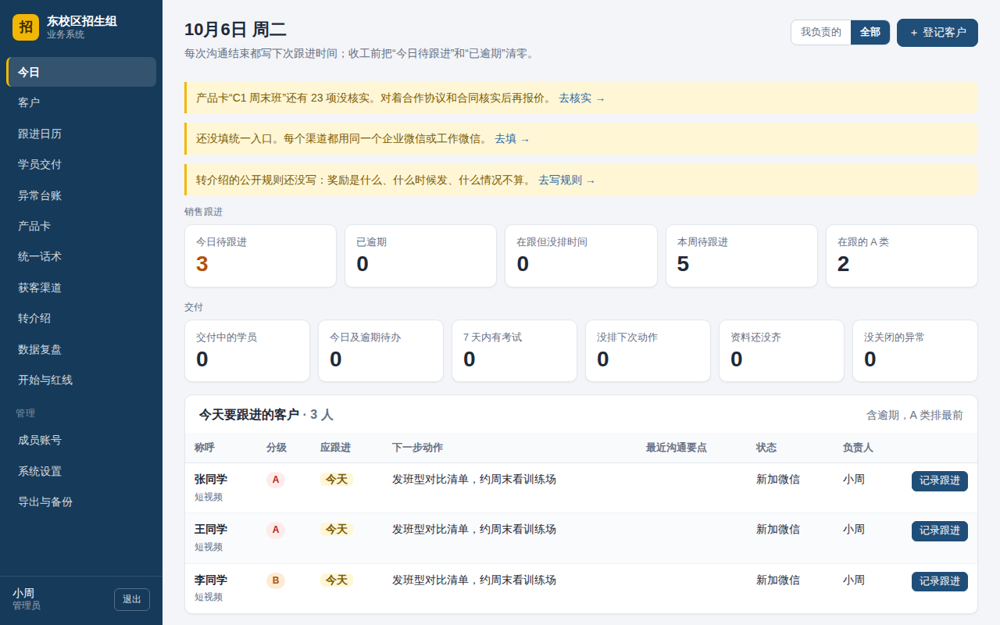 | 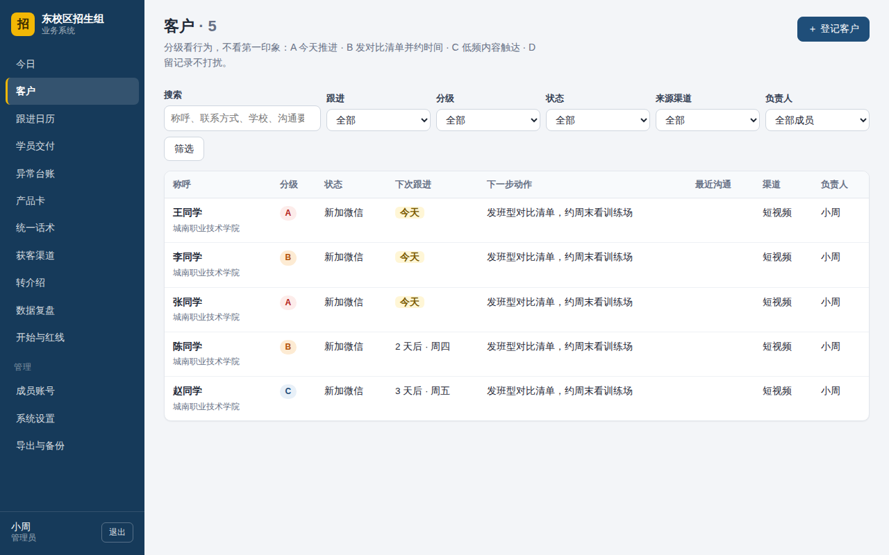 |
| **对客产品卡**（可截图 / 复制文字 / 打印 PDF） | **数据复盘**（漏斗看板） |
| 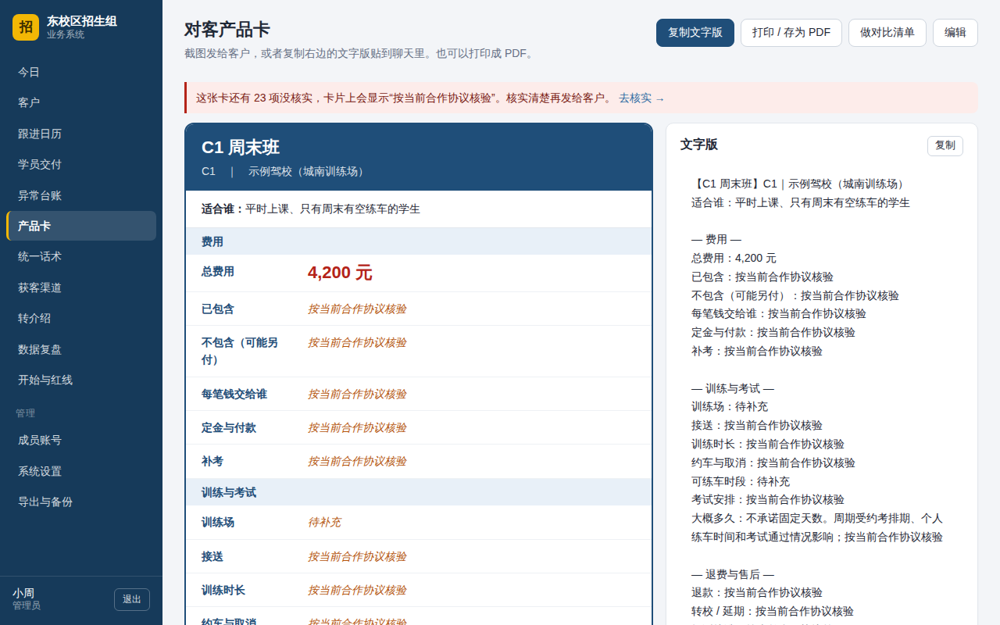 | 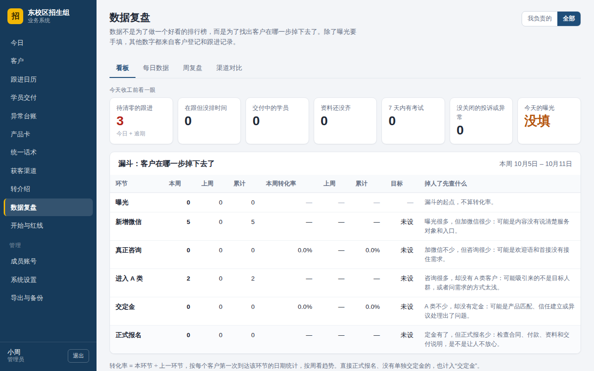 |
| **统一话术** | **获客渠道** |
| 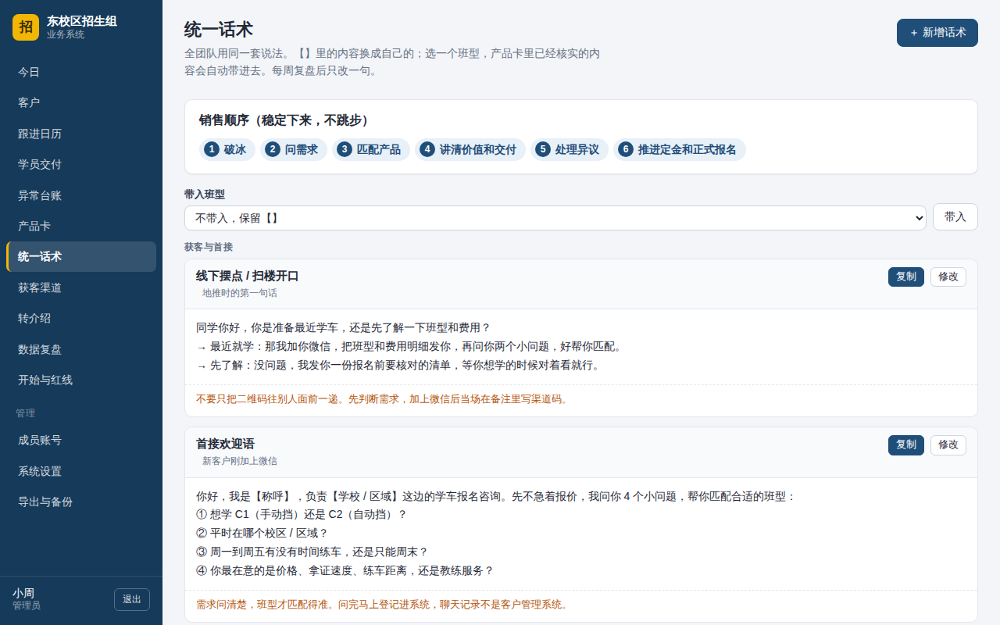 | 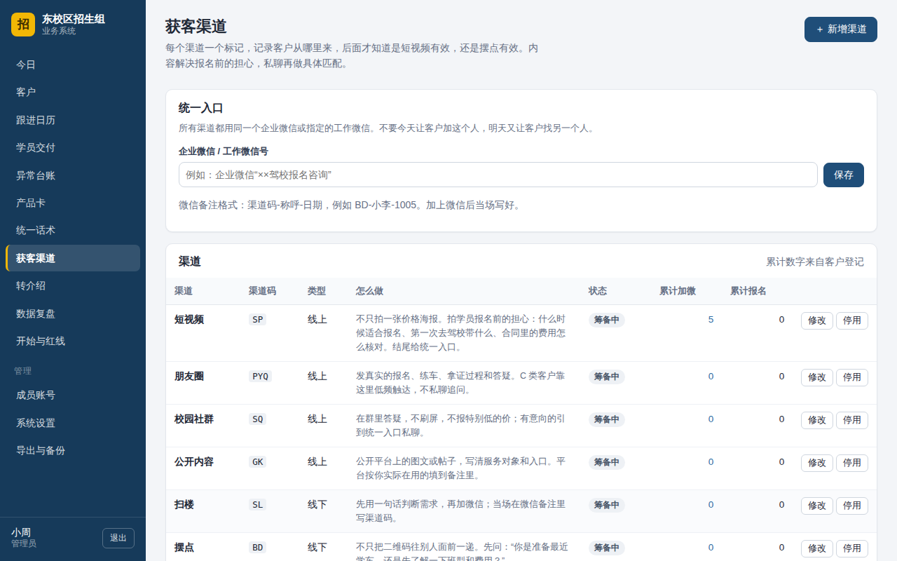 |
| **跟进日历** | **转介绍** |
| 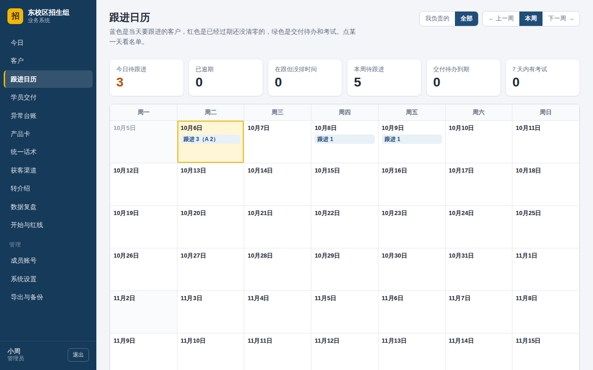 | 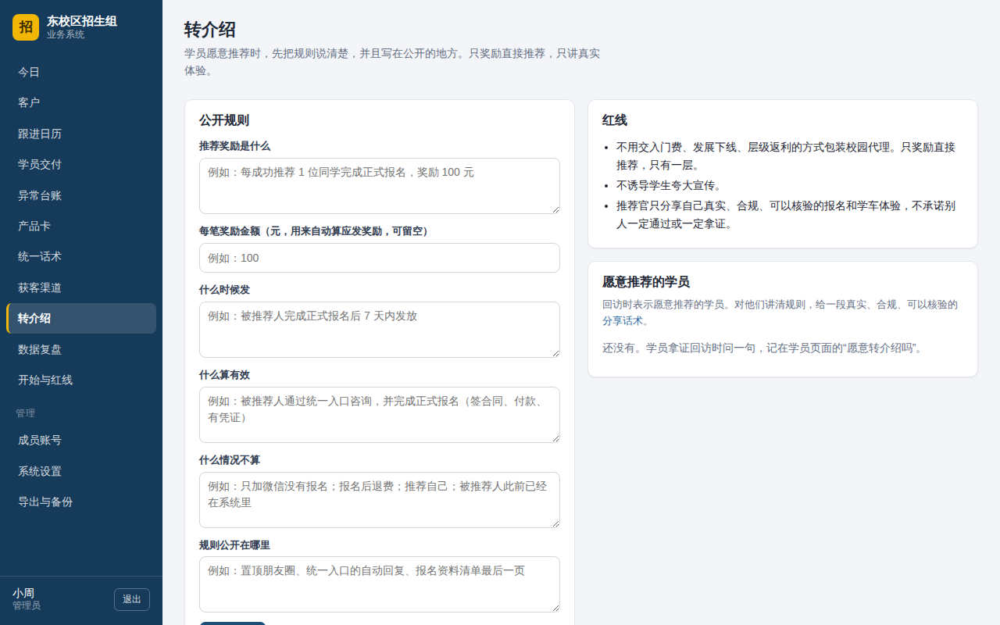 |

<details>
<summary>更多截图：首次初始化、开始与红线、手机端</summary>

| 首次初始化 | 开始与红线 | 手机端 |
| --- | --- | --- |
| 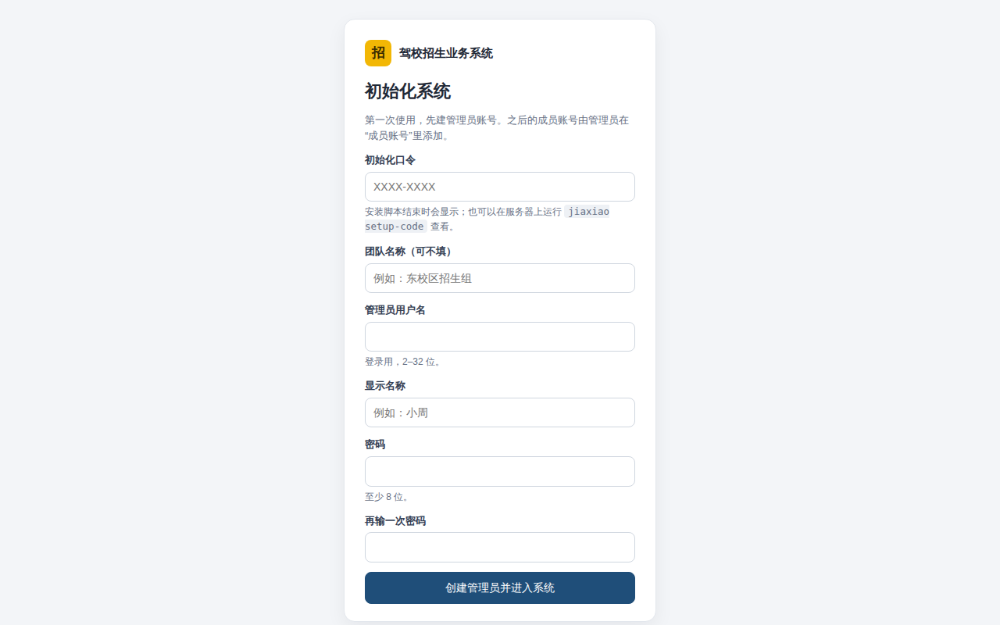 | 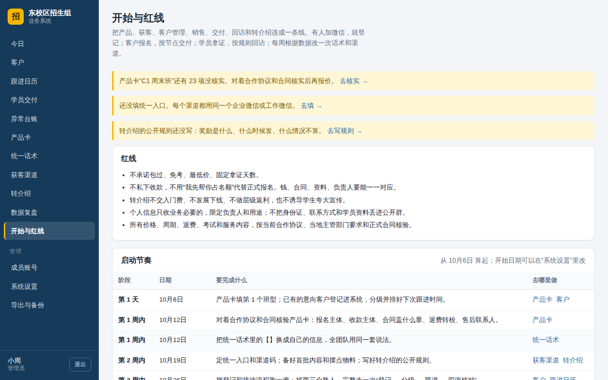 | 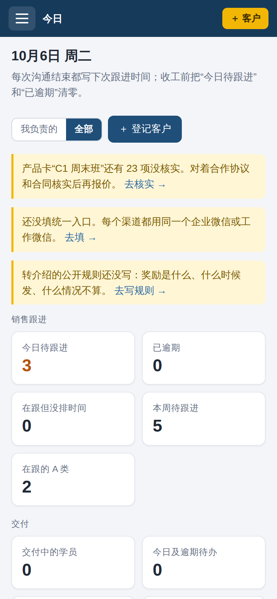 |

</details>

## 🚀 快速开始（网页版）

**想先试一下（任何装了 Python 3.8+ 的电脑都行，Windows / macOS / Linux）：**

```bash
git clone https://github.com/a16689525392-prog/jiaxiaohuoke.git jiaxiao
cd jiaxiao
python3 run.py
```

终端里会打印一个**初始化口令**（形如 `ABCD-2345`）。浏览器打开 <http://127.0.0.1:8000>，填口令、创建管理员即可。
数据放在当前目录的 `data/` 里，`Ctrl+C` 停止。

**正式部署到 Ubuntu 服务器：**

```bash
git clone https://github.com/a16689525392-prog/jiaxiaohuoke.git jiaxiao
cd jiaxiao
sudo bash install.sh
```

或者到 [Releases](https://github.com/a16689525392-prog/jiaxiaohuoke/releases) 下载 `jiaxiao-x.y.z.tar.gz` 安装包（适合没法访问 GitHub 的内网机器：在别的电脑上下载，拷过去再装）。

---

## 一、安装（Ubuntu）

**要求**：Ubuntu 20.04 / 22.04 / 24.04，系统自带的 `python3`（3.8 或更高）。
不需要联网，不需要安装任何别的软件。

```bash
# 方式 A：用 Release 安装包
tar -xzf jiaxiao-1.0.0.tar.gz
cd jiaxiao-1.0.0
sudo bash install.sh

# 方式 B：直接用 git 仓库
git clone https://github.com/a16689525392-prog/jiaxiaohuoke.git jiaxiao
cd jiaxiao
sudo bash install.sh
```

装完以后屏幕上会显示访问地址和一个**初始化口令**（形如 `ABCD-2345`）。
用浏览器打开地址，填口令，创建管理员账号，就可以用了。

安装脚本做了这些事，除此以外不动系统里的任何东西（也不改防火墙）：

| 位置 | 内容 |
| --- | --- |
| `/opt/jiaxiao` | 程序文件（只读） |
| `/var/lib/jiaxiao` | 数据：数据库 `jiaxiao.db` 和 `backups/` 里的每日备份 |
| `/etc/jiaxiao/jiaxiao.env` | 设置：端口、监听地址、时区 |
| `/etc/systemd/system/jiaxiao.service` | 开机自动启动的服务，用专门的账号 `jiaxiao` 运行 |
| `/usr/local/bin/jiaxiao` | 管理命令 |

可选参数：

```bash
sudo bash install.sh --port 8080     # 换端口（默认 8000）
sudo bash install.sh --local-only    # 只允许这台机器自己访问
sudo bash install.sh --lan           # 允许局域网里的设备访问（默认）
```

如果这台机器的网卡上直接有公网地址，第一次安装会默认只开放给本机，并在屏幕上说明怎么改。

## 二、开始使用

1. 打开网页，用初始化口令创建管理员。
2. **产品卡**：填第 1 个班型。没核实的项目保留“按当前合作协议核验”，对着合作协议和合同核实后再改。
3. **成员账号**（左下“管理”）：给每个人建账号，把用户名和初始密码告诉本人，让他们登录后在“我的账号”里改密码。
4. **获客渠道**：填统一入口；**转介绍**：写公开规则。
5. 有人加微信就在**客户**里登记，每次沟通后写下次跟进时间。之后每天打开**今日**照着做。

“开始与红线”页面里有启动节奏和每天、每周、每月的固定动作。

在手机上用：手机和这台机器连同一个局域网（同一个 Wi‑Fi），浏览器打开同样的地址即可。

## 三、管理命令

```bash
sudo jiaxiao status                 # 服务是不是在运行、访问地址
sudo jiaxiao start | stop | restart
sudo jiaxiao logs                   # 看日志；加 -f 持续滚动
sudo jiaxiao url                    # 显示访问地址
sudo jiaxiao port 8080              # 改端口
sudo jiaxiao setup-code             # 再看一次初始化口令
sudo jiaxiao reset-password 用户名   # 重置密码（管理员忘记密码时用）
sudo jiaxiao create-admin 用户名     # 再建一个管理员
sudo jiaxiao backup                 # 立即备份一次
sudo jiaxiao restore 备份文件        # 用一份备份替换现在的全部数据
```

成员忘记密码：管理员在“成员账号”里给他们重置。

## 四、备份与恢复

- 系统每天凌晨 3 点以后自动备份一次，保留最近 30 份，放在 `/var/lib/jiaxiao/backups/`。
- 管理员可以在“导出与备份”页面手动备份、下载备份文件，也可以把客户、跟进记录、学员、异常导出成表格（CSV）。
- **备份和数据库在同一台机器上，机器坏了会一起丢。** 建议定期下载一份存到别处。
- 恢复：

  ```bash
  sudo jiaxiao restore jiaxiao-20261006-030000.db     # backups 目录里的文件名
  sudo jiaxiao restore /home/me/下载的备份.db           # 或者任意位置的备份文件
  ```

  会先问你确认；替换之前自动把当前数据另存一份（`before-restore-日期.db`）。恢复后所有人需要重新登录。

## 五、升级和卸载

**升级**：拿到新版本（解压新的安装包，或在仓库目录里 `git pull`），在新代码目录里再运行一次 `sudo bash install.sh`。数据和设置都保留。

**卸载**：

```bash
sudo bash /opt/jiaxiao/uninstall.sh            # 卸载程序和服务，数据保留在 /var/lib/jiaxiao
sudo bash /opt/jiaxiao/uninstall.sh --purge    # 连数据一起删除，不能恢复
```

## 六、用 Docker 运行（另一种方式）

和上面的安装方式二选一，不要同时用。需要已经装好 Docker 和 compose 插件，并且能拉取 `python:3.12-slim` 镜像
（拉不下来的话，用上面的安装脚本，它不需要联网）。

```bash
git clone https://github.com/a16689525392-prog/jiaxiaohuoke.git jiaxiao
cd jiaxiao
docker compose up -d --build
docker compose logs jiaxiao | grep 初始化口令        # 第一次创建管理员要用
```

然后打开 `http://这台机器的地址:8000`。数据在名为 `jiaxiao-data` 的卷里，`docker compose down` 不会删除它。

```bash
docker compose exec jiaxiao python3 run.py setup-code
docker compose exec jiaxiao python3 run.py reset-password 用户名
docker compose exec jiaxiao python3 run.py backup
docker compose exec jiaxiao python3 run.py restore jiaxiao-20261006-030000.db
docker compose cp jiaxiao:/data/backups ./backups      # 把备份复制到宿主机
docker compose up -d --build                           # 升级：换成新版本的文件后重新构建
```

换端口、只让本机访问：改 `docker-compose.yml` 里的 `ports`，文件里有说明。
注意 Docker 发布的端口不受 `ufw` 管，默认的 `8000:8000` 会在这台机器的所有网卡上监听。

## ⚙️ 配置项（环境变量）

装成服务时这些设置在 `/etc/jiaxiao/jiaxiao.env`，Docker 方式在 `docker-compose.yml` 的 `environment`，直接运行时用环境变量传入。

| 变量 | 默认值 | 说明 |
| --- | --- | --- |
| `JX_DATA_DIR` | `./data` | 数据库和备份放在哪 |
| `JX_HOST` | `0.0.0.0` | 监听地址；`127.0.0.1` 表示只允许本机访问 |
| `JX_PORT` | `8000` | 端口 |
| `JX_TZ_OFFSET` | `8` | “今天”按哪个时区算（相对 UTC 的小时数，北京时间填 8） |
| `JX_ALLOW_PUBLIC` | `0` | 设为 `1` 才接受来自公网地址的访问（**不建议**，见下文） |

命令行（不装服务时）：

```bash
python3 run.py                         # 启动网页服务
python3 run.py setup-code              # 查看首次初始化口令
python3 run.py reset-password 用户名    # 重置密码
python3 run.py create-admin 用户名      # 新增管理员
python3 run.py backup                  # 立即备份
python3 run.py restore 备份文件         # 从备份恢复（加 --yes 跳过确认）
python3 run.py version                 # 显示版本
```

## 七、访问范围和安全

这套系统是按**只在内网或本机使用**来做的：

- 用的是不加密的 `http`。不要在路由器或云服务器的安全组里把端口开放到公网。
- 系统自己会拒绝来自公网地址的访问（内网、本机、`100.64.0.0/10` 这类组网地址不受影响）。
  “系统设置”页面最下面能看到当前的访问范围。
- 密码加盐后做慢哈希保存；同一个用户名或同一个地址连续输错 8 次，10 分钟内不能再试。
- 登录状态 14 天不用自动失效；改密码或被停用后，其他设备上的登录立即退出。
- 数据目录只有运行账号 `jiaxiao` 和管理员能读。
- 只登记业务必要的个人信息，不登记身份证号。导出的表格里有客户的个人信息，不要发到公开群里。

确实要从外面访问，建议用自己的组网或 VPN 工具接回内网。
直接放开公网访问（把 `/etc/jiaxiao/jiaxiao.env` 里的 `JX_ALLOW_PUBLIC` 改成 `1`）不安全：登录密码会在网络上明文传输。
如果一定要这么做，前面必须加一层 HTTPS 反向代理（例如 Nginx / Caddy）和额外的访问控制。

发现安全问题请不要直接公开发 Issue，先通过 GitHub 的私信或 Security Advisory 联系维护者。

## 八、常见问题

**局域网里别的设备打不开**
依次检查：两台设备是不是在同一个网络；`sudo jiaxiao status` 显示的地址对不对；
这台机器有没有开防火墙（`sudo ufw status`），开了就放行本网段，例如
`sudo ufw allow from 192.168.0.0/16 to any port 8000 proto tcp`；
安装时是不是用了 `--local-only`（改回来：`sudo bash install.sh --lan`）。

**端口被占用**　`sudo jiaxiao port 8080` 换一个。

**页面上的“今天”不对**　“今天”按北京时间（东八区）算。别的时区改 `/etc/jiaxiao/jiaxiao.env` 里的 `JX_TZ_OFFSET`，
然后 `sudo jiaxiao restart`。

**服务起不来**　`sudo jiaxiao logs` 看最后几行，里面会写原因。

**有人离开团队**　管理员在“成员账号”里停用这个账号（记录都保留），同一页面可以把这个人名下的客户和学员一次转给别人。

**不装成服务，只想临时跑一下**

```bash
python3 run.py            # 数据放在当前目录的 data/ 里，Ctrl+C 停止
```

**Windows / macOS 能用吗**　`python3 run.py` 直接运行可以（只要有 Python 3.8+）。`install.sh` 和 `jiaxiao` 管理命令只适用于带 systemd 的 Linux（Ubuntu）。

## 📱 微信小程序版

> 代码在 [`wechat-miniprogram/`](wechat-miniprogram/)，完整部署手册见 [wechat-miniprogram/README.md](wechat-miniprogram/README.md)。

招生团队自己用的微信小程序工作台：登记客户、排跟进时间、付款前四项核对、按节点做交付。
和网页版是同一套规则，数据放在你自己小程序的**微信云开发**里，不需要服务器、域名和备案的网站。

### 界面

> 下面是用仓库自带的本地渲染脚本（`tests/mp/shots.js`）画出来的演示数据截图，和真机上的样子接近但不完全一样。

| 欢迎 / 创建团队 | 今日 | 客户 | 客户详情 |
| --- | --- | --- | --- |
| 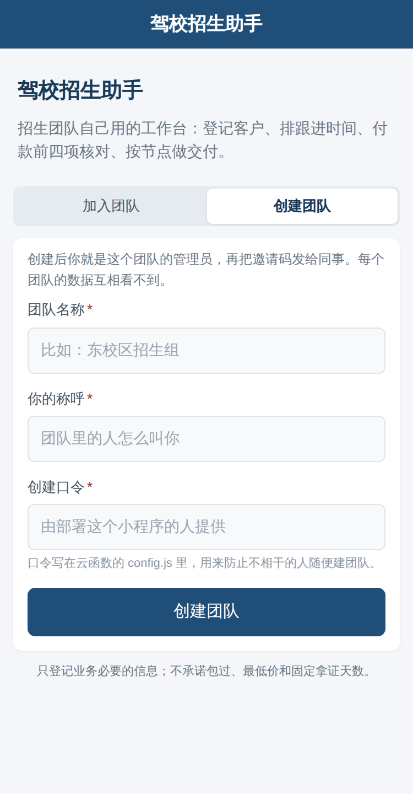 | 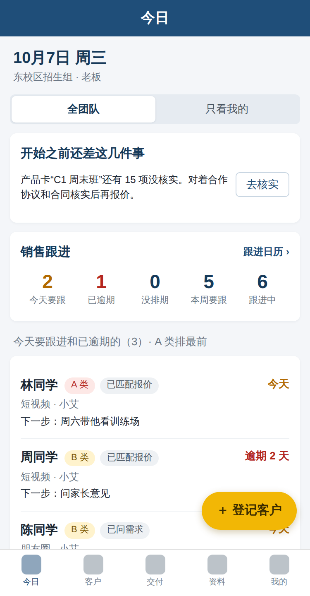 | 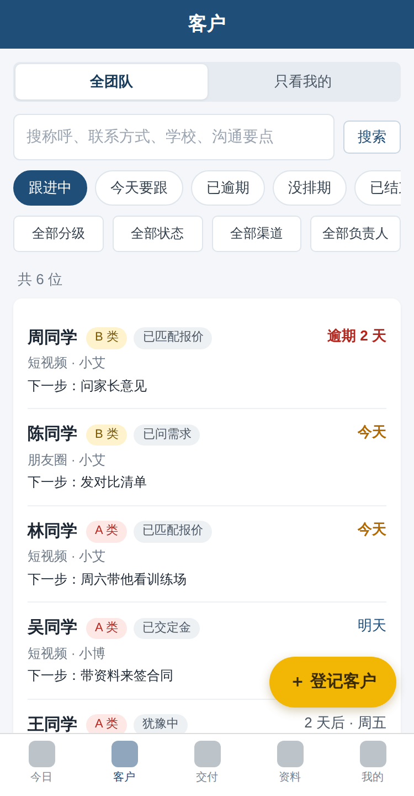 | 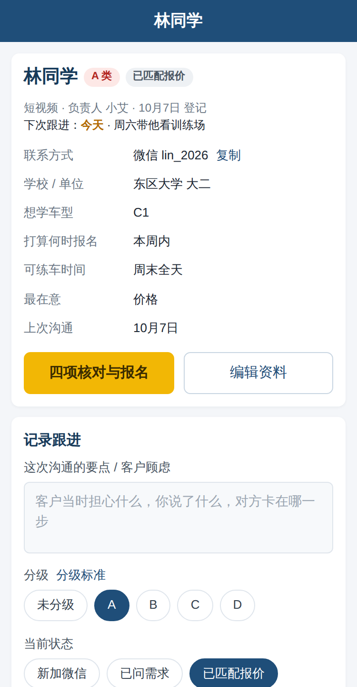 |
| **收定金 / 正式报名** | **交付** | **学员交付清单** | **资料** |
| 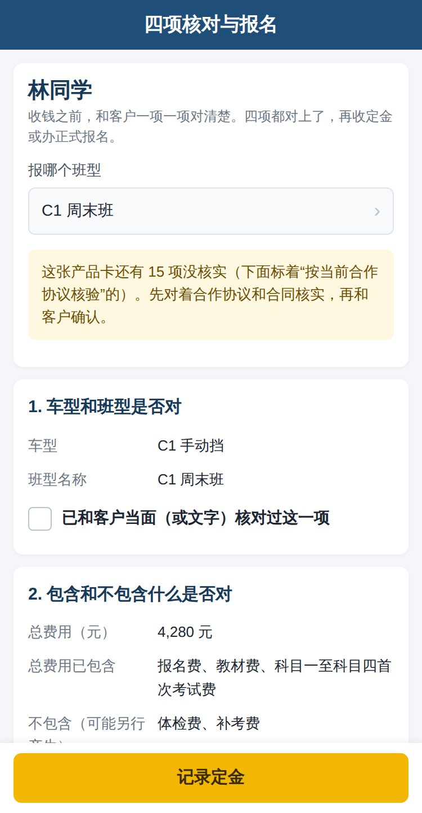 | 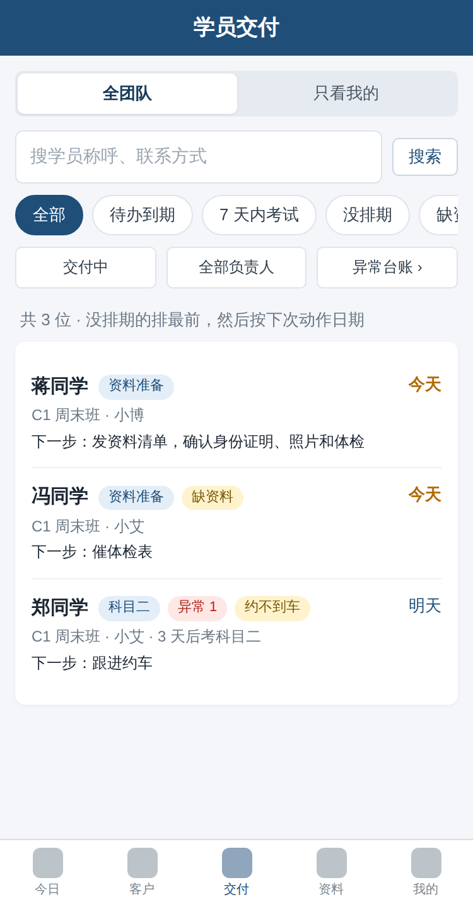 | 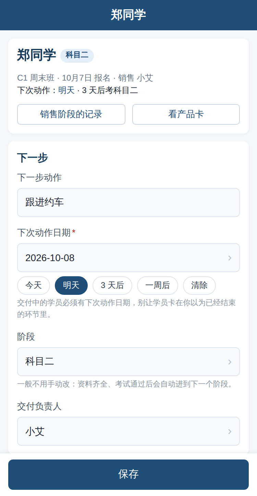 | 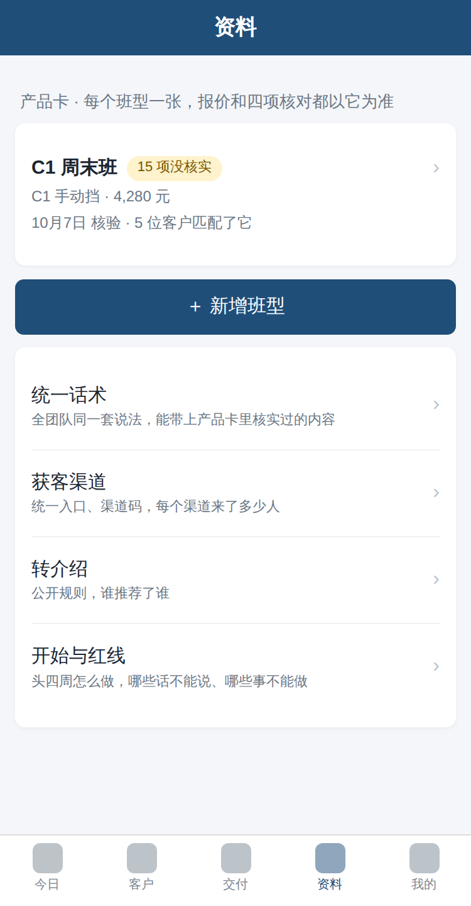 |
| **产品卡** | **我的** | **数据看板** | **自检** |
| 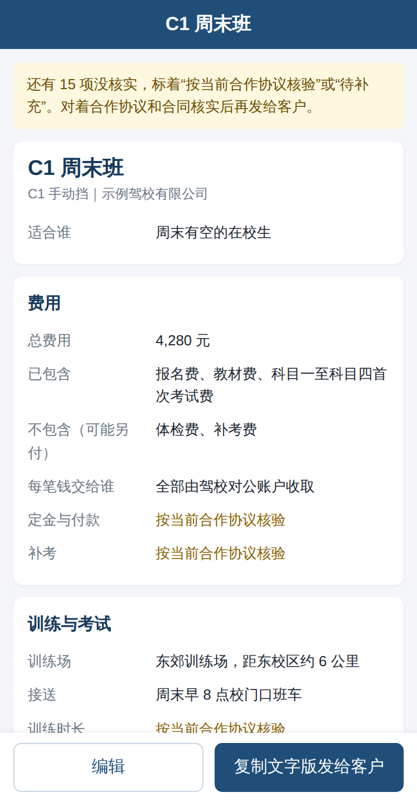 | 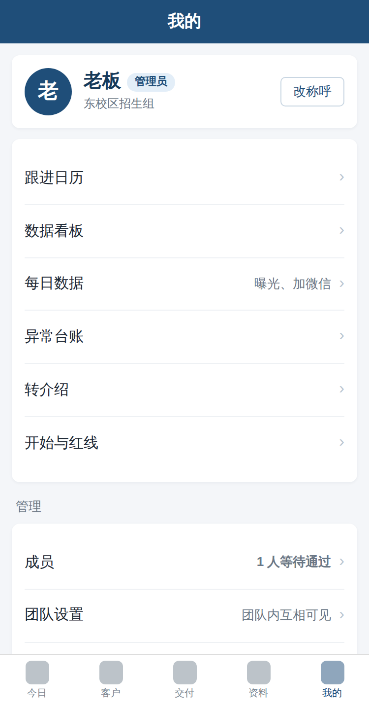 | 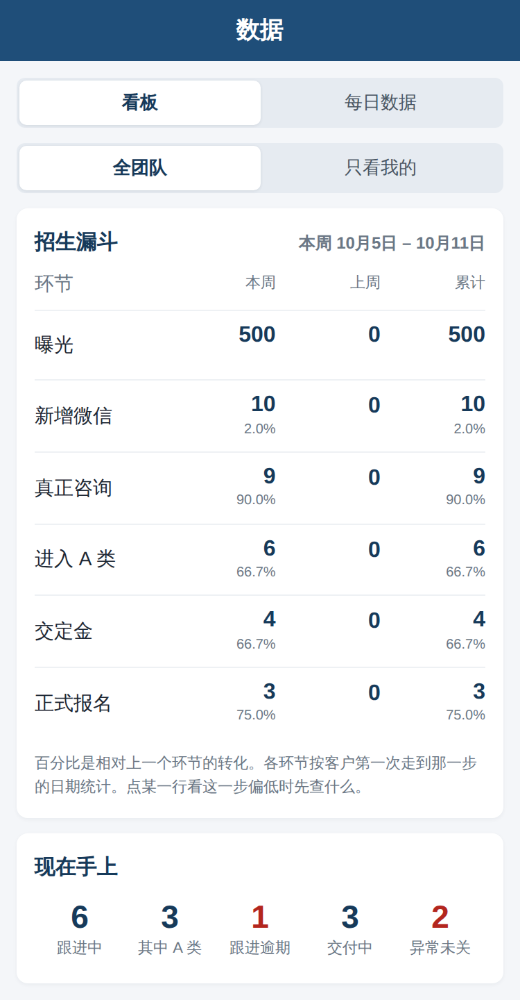 | 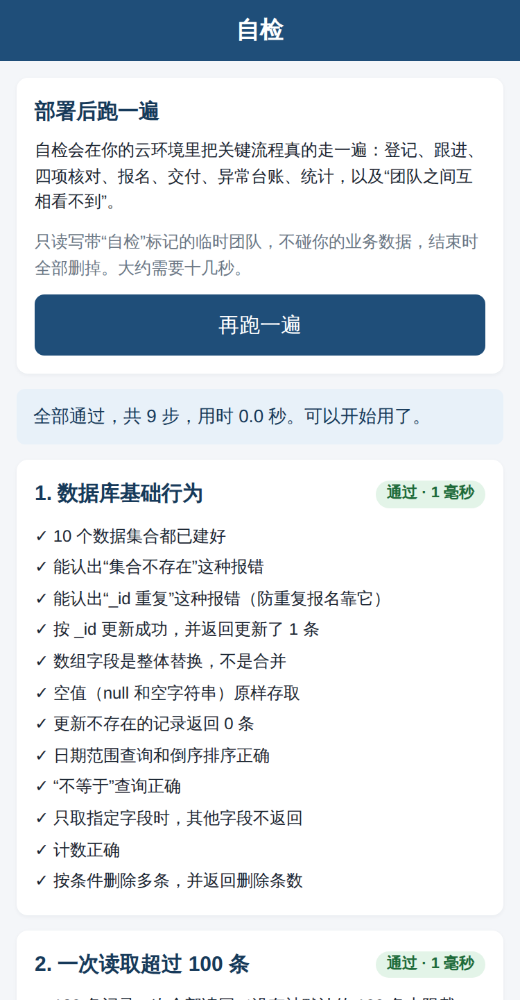 |

### 功能

| 底部页签 | 做什么 |
| --- | --- |
| 今日 | 今天要跟进谁、谁逾期了、谁没排期；哪些学员待办到期、7 天内要考试 |
| 客户 | 登记、分级（A/B/C/D）、记录跟进、付款前四项核对、收定金 / 正式报名 |
| 交付 | 正式报名后的学员：节点清单、资料、四科考试、拿证回访、异常台账 |
| 资料 | 产品卡、统一话术（能自动带上产品卡里核实过的内容）、获客渠道、转介绍、开始与红线 |
| 我的 | 跟进日历、数据看板、每日数据；管理员还有成员、团队设置、自检 |

写死在程序里的规矩：在跟的客户必须有下次跟进时间；“已交定金”“已正式报名”只能在付款前四项核对之后设；
异常要写清联系了谁、预计何时解决，回访确认后才算关闭；看起来像身份证号的内容存不进去；产品卡上没核实的项目一律显示“按当前合作协议核验”。

### 部署（大约 10 分钟）

1. **下载代码**：`git clone https://github.com/a16689525392-prog/jiaxiaohuoke.git`，或在 GitHub 页面点 Code → Download ZIP。
2. **导入项目**：微信开发者工具 → 导入项目 → 选 `wechat-miniprogram` 文件夹。**AppID 换成你自己的小程序**，后端服务选“微信云开发”。
3. **确认云环境**：只开通一个环境不用管；有多个时把环境 ID 填进 `miniprogram/config.js` 的 `ENV_ID`。
4. **改创建口令（必做）**：`cloudfunctions/api/config.js` 里的 `TEAM_CREATE_CODE` 默认是 `CHANGE-ME`，
   开源仓库里人人看得到，**一定要换成你自己的一串字符**，否则任何人都能在你的云环境里建团队。
5. **部署云函数**：右键 `cloudfunctions/api` → “创建并部署：云端安装依赖（不上传 node_modules）”。
6. **创建团队**：模拟器里选“创建团队”，填团队名称、称呼和口令，你就是管理员。
7. **跑一遍自检**：我的 → 自检 → 开始自检。会在你的云环境里把登记、跟进、报名、交付、异常、统计和团队隔离真的走一遍（9 步），
   用的临时数据最后全部删掉。全部通过就可以用了。

**上线前**（只能在微信公众平台后台做）：服务类目选“工具”下的类目；在“用户隐私保护指引”里声明使用剪切板；
完成小程序备案；提交审核时在备注里写明“团队内部工具”并附上创建口令。详见 [小程序 README 的“上线之前”](wechat-miniprogram/README.md#上线之前这几件事只能你自己在微信后台做)。

### 团队与数据

- **邀请同事**：我的 → 成员，把邀请码发给对方；对方选“加入团队”，管理员点“通过”。一个微信号只能在一个团队里。
- **两种角色**：管理员看全部、改产品卡 / 话术 / 渠道 / 设置；成员做日常登记、跟进、交付。可以打开“成员只看自己的”。
- **数据安全**：小程序端不直接读写数据库，全部经过云函数 `api`，云函数只认微信传来的 openid，并按团队和权限过滤；
  数据在 10 个 `jx_` 开头的集合里。集合权限保持默认“仅创建者可读写”，**不要**改成“所有用户可读”。
- **备份**：云开发控制台 → 数据库 → 选集合 → 导出（小程序里没有做导出功能）。

### 和网页版的区别

- 小程序版没做：周复盘、月度渠道对比和成本、对比清单、内容选题、转介绍奖励的发放记录、漏斗目标线、导出和备份。
- 小程序版多出来的：团队和邀请码（一个云环境可以有多个互相隔离的团队）。
- 两边的数据不互通。

### 本地测试

需要 Node 18 或更新的版本，不需要安装任何依赖：

```bash
cd wechat-miniprogram
node --test tests/test_*.js
```

共 95 项：直接调用云函数检查规则、权限和团队隔离；在 Node 里模拟小程序运行时按界面文字点击、输入；静态检查页面登记、WXML 绑定和云函数动作。
这些测试用的是假的数据库和假的运行环境，替代不了真机 —— 真实环境由“自检”和开发者工具里的实际操作来确认。

## 🛠 参与开发

### 目录结构

```
run.py            入口和命令行
app/              程序：web.py 路由和服务器，tpl.py 模板，db.py 数据库结构，
                  auth.py 登录和权限，v_*.py 各个页面，consts.py 内置的清单、话术和选项
templates/        页面模板          static/   样式和脚本
tests/            自动化测试         deploy/   systemd 服务文件和 jiaxiao 命令
docs/             说明文档用的截图    .github/  CI 和自动发布
install.sh  uninstall.sh  Dockerfile  docker-compose.yml

wechat-miniprogram/       微信小程序版（单独的项目，用微信开发者工具打开这个文件夹）
  miniprogram/            小程序端：25 个页面、公共片段、调用云函数的封装
  cloudfunctions/api/     唯一的云函数：团队、客户、交付、资料、今日与数据、自检
  tests/                  Node 本地测试（假数据库 + 假小程序运行时）
  project.config.json     开发者工具的项目配置
```

只用 Python 标准库和 SQLite，没有第三方依赖。内置的话术、交付清单和默认渠道在 `app/consts.py`，
已经写进数据库的话术和渠道请在页面里改。

### 本地开发与测试

```bash
python3 run.py                                   # 启动，改完代码重启即可
python3 -m unittest discover -s tests -v         # 运行网页版全部测试
(cd wechat-miniprogram && node --test tests/test_*.js)   # 运行小程序版全部测试
```

每次 push 和 Pull Request，GitHub Actions 会在 Python 3.8 ~ 3.13 上跑网页版测试、检查 Docker 镜像能否构建和启动，
并在 Node 18 / 20 / 22 上跑小程序版测试。

### 发布新版本

**网页版**

1. 修改 `app/core.py` 里的 `VERSION`，在 [CHANGELOG.md](CHANGELOG.md) 写上变化。
2. 打标签并推送：`git tag v1.0.1 && git push origin v1.0.1`
3. GitHub Actions 会自动跑测试、打包 `jiaxiao-1.0.1.tar.gz`，并创建 Release。

**小程序版**

1. 修改 `wechat-miniprogram/cloudfunctions/api/config.js` 里的 `VERSION`，在 [CHANGELOG.md](CHANGELOG.md) 写上变化。
2. 改了云函数：开发者工具里右键 `cloudfunctions/api` →“上传并部署：云端安装依赖”。
3. 改了小程序端：开发者工具“上传”，到微信公众平台提交审核、发布。

### 贡献

欢迎提 Issue 和 Pull Request。提交前请确认两边的测试都通过，
并保持网页版“只用 Python 标准库”、小程序版“除 `wx-server-sdk` 外不引入第三方依赖”的原则。
**不要把自己的创建口令、云环境 ID 或任何密钥提交到仓库。**

## ✅ 测试情况

**网页版**

- 自动化测试 71 项，在 Python 3.8、3.9、3.10、3.11、3.12、3.13、3.14 上全部通过，
  包括经过真实 HTTP 服务器的整套流程和并发写入。
- 用真实浏览器（Chromium，电脑和手机两种屏幕宽度）点过从初始化到报名、交付的完整流程。
- `install.sh`、`uninstall.sh` 和 `jiaxiao` 命令在 Ubuntu 24.04 上实际运行过：安装、升级、换端口、备份、恢复、卸载都走了一遍。
  测试环境里没有运行中的 systemd，“启动 / 停止服务”这一步是用替身程序代替的；服务文件本身用 `systemd-analyze verify` 检查过。
- **没有实际跑过的**：真实 systemd 下的服务启动。第一次部署后请用 `sudo jiaxiao status` 确认一下。
  Docker 镜像的构建和启动由 CI 自动检查。

**小程序版**

- 本地自动化测试 95 项全部通过（Node 22），CI 在 Node 18 / 20 / 22 上运行。
- 真实云环境里的行为由小程序内置的“自检”验证（9 步，含团队隔离），部署后请跑一次。

## 📄 说明与免责声明

系统里的流程、清单和话术按《驾校业务视频完整文案》整理，文案里的做法未经独立核验。
所有价格、周期、退费、考试和服务内容，以当前合作协议、当地主管部门要求和正式合同为准。

## 许可证

[MIT](LICENSE)
